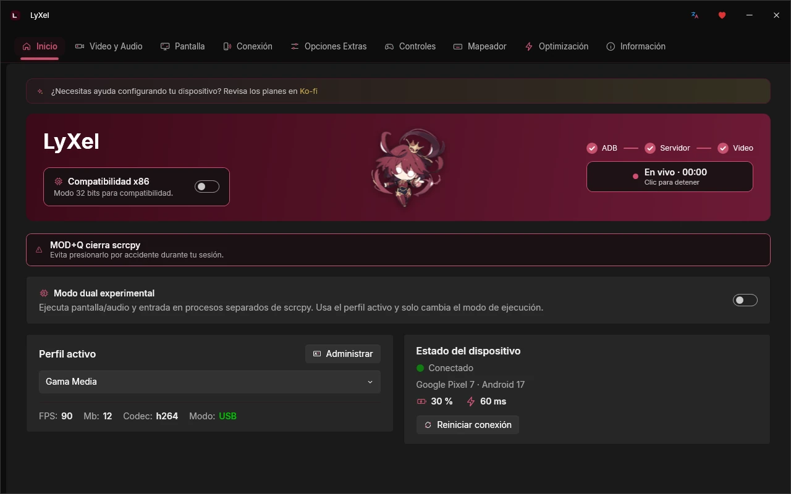
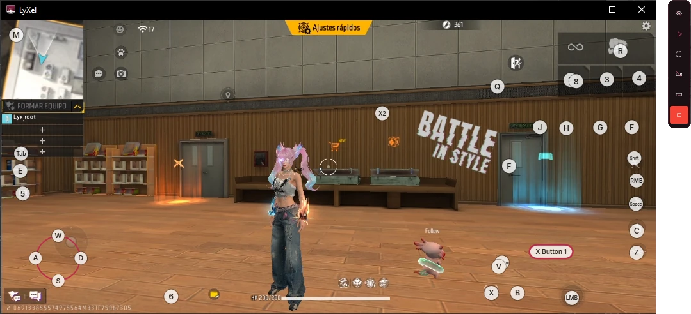
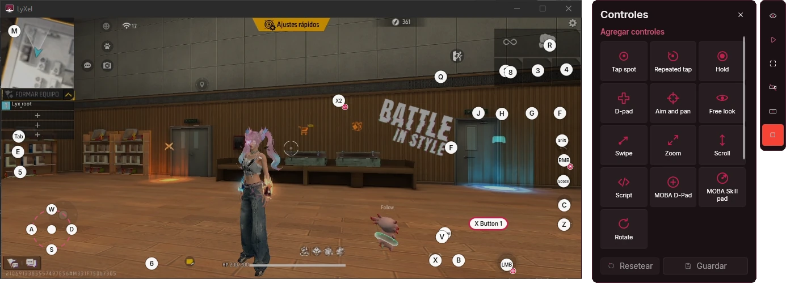
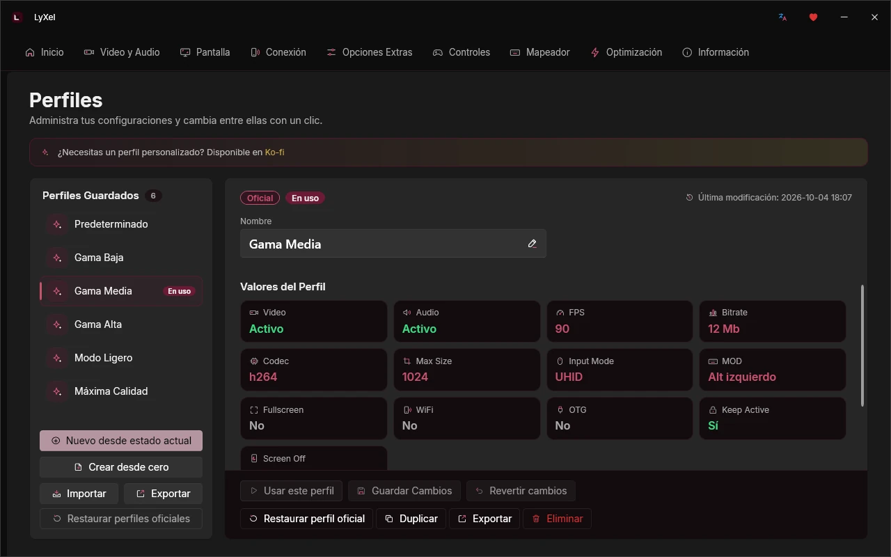
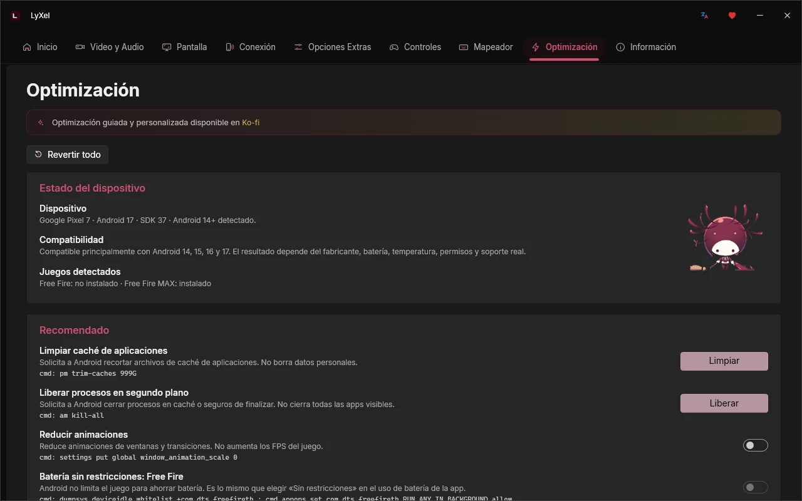
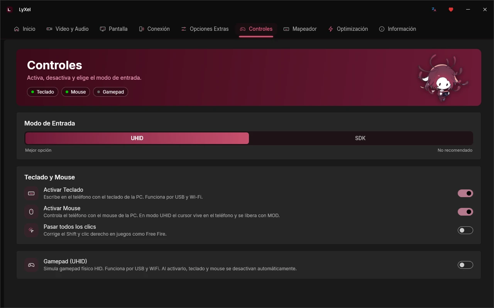
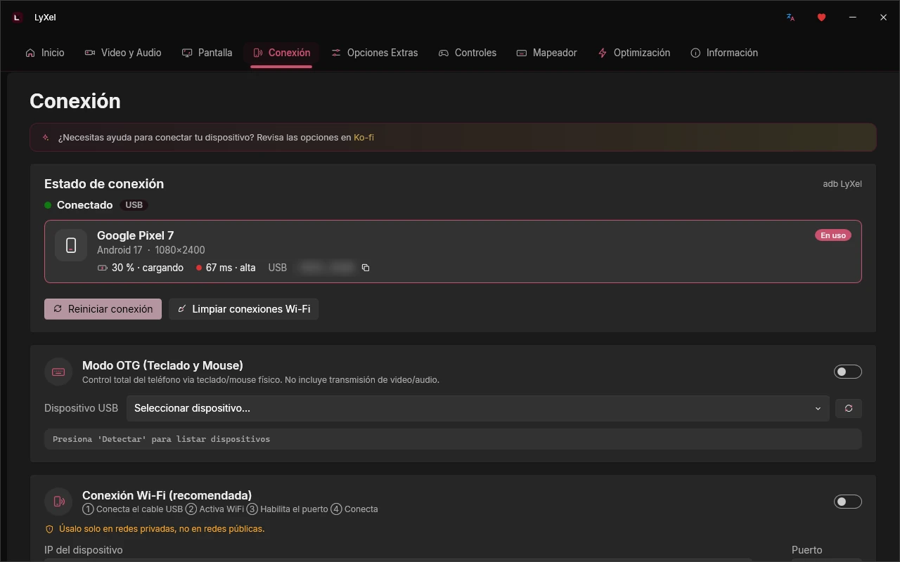

  

<h1 align="center">LyXel</h1>

Muestra y controla tu Android desde la PC. Juega con teclado y mouse.

  
  
  
  

  <a href="https://sudonks.github.io/Lyxel/">Sitio web</a> ·
  <a href="https://github.com/sudoNks/Lyxel/releases/latest">Descargar</a> ·
  <a href="https://discord.gg/CU5quVNyun">Discord</a> ·
  <a href="https://www.youtube.com/@Nks_v1">YouTube</a> ·
  <a href="https://ko-fi.com/nks_array">Ko-fi</a>

  

## Qué es LyXel

LyXel es una aplicación gratuita para Windows que muestra la pantalla de tu teléfono Android en la computadora y te deja usarlo con el teclado y el mouse. Usa [scrcpy](https://github.com/Genymobile/scrcpy) como motor y le agrega una interfaz, un Mapeador para juegos, perfiles y herramientas para el teléfono, sin escribir comandos.

Antes se llamaba MobiladorSteX.

## Novedades de la 1.8.1

- La cámara ya no se acelera al apuntar con el mouse.
- Importa los controles de tu emulador: BlueStacks y MSI App Player.
- Interfaz renovada: íconos, textos y una mascota nueva.
- Conexión sin cable con asistente.
- Benchmarks para ver el rendimiento de cada sesión.
- Disponible en español, inglés, portugués y alemán.
- Arreglos en avisos y notificaciones.

## Mapeador

  

Pon controles encima del juego y úsalos con el teclado y el mouse. El juego corre en tu teléfono, con tu cuenta; la PC solo lo muestra y le manda tus teclas.

- Editor al estilo de los emuladores: toque, mantener, joystick, apuntar, deslizar, zoom, scripts y controles MOBA.
- Cámara sin aceleración y frecuencia de envío de 125 a 1000 Hz.
- FPS y latencia en pantalla.
- Perfiles que se ajustan solos a cualquier resolución.
- Barra flotante para ocultar los controles, pasar a pantalla completa o jugar mirando el teléfono.

  

### Importar desde BlueStacks o MSI

1. Durante la sesión, pulsa **Controles** en la barra flotante.
2. En **Perfil de controles**, pulsa **Importar**.
3. Elige el archivo `.cfg` de tu emulador.

BlueStacks y MSI guardan los esquemas en la carpeta `Engine\UserData\InputMapper\UserFiles` de su instalación.

## Más funciones

<table>
  <tr>
    <td width="50%"> <b>Perfiles.</b> Seis listos, de gama baja a máxima calidad, y los tuyos.</td>
    <td width="50%"> <b>Optimización.</b> Limpia caché, libera procesos y prepara el teléfono para jugar.</td>
  </tr>
  <tr>
    <td width="50%"> <b>Controles.</b> Teclado, mouse y gamepad, con modo UHID.</td>
    <td width="50%"> <b>Conexión.</b> Por cable o sin cable, y reconexión en un clic.</td>
  </tr>
</table>

También trae tecla de atajos (MOD) a tu gusto, pantalla virtual con la resolución y el DPI que elijas, aceleración por hardware en 64 bits y un modo de compatibilidad para equipos de 32 bits.

## scrcpy y LyXel

| | scrcpy | LyXel |
|---|---|---|
| Cómo se usa | Comandos en la terminal | Interfaz gráfica en cuatro idiomas |
| Mapeador para juegos | No incluye | Editor de controles al estilo emulador |
| Controles de BlueStacks o MSI | No los lee | Los importa |
| Tecla de atajos (MOD) | Solo Ctrl, Alt o Super, con un comando | Cualquier tecla, desde la aplicación |
| Configuración | Parámetros cada vez que lo abres | Perfiles listos y los tuyos |
| Conexión sin cable | Comandos de adb | Asistente y reconexión en un clic |
| Optimización del teléfono | No incluye | Limpieza y ajustes para jugar |
| Rendimiento | FPS en la consola | FPS y latencia en pantalla, y benchmarks |

## Descarga

| Plataforma | Archivo |
|---|---|
| Windows 10 y 11, 64 y 32 bits | [LyXel_Setup_v1.8.1.exe](https://github.com/sudoNks/Lyxel/releases/download/v1.8.1/LyXel_Setup_v1.8.1.exe) · [.zip](https://github.com/sudoNks/Lyxel/releases/download/v1.8.1/LyXel_Setup_v1.8.1.zip) |
| Linux x64 | [lyxel-v1.0.3-linux-x64.tar.gz](https://github.com/sudoNks/Lyxel/releases/download/linux-v1.0.3/lyxel-v1.0.3-linux-x64.tar.gz) |

En un equipo de 32 bits, activa **Compatibilidad x86** en Inicio después de instalar. Los hashes SHA-256 están en [SHA256SUMS.txt](https://github.com/sudoNks/Lyxel/releases/download/v1.8.1/SHA256SUMS.txt).

Todas las versiones: [Releases](https://github.com/sudoNks/Lyxel/releases)

## Primeros pasos

1. En el teléfono, entra a Ajustes > Acerca del teléfono y toca 7 veces **Número de compilación**. Luego, en **Opciones de desarrollador**, activa **Depuración USB**. En Xiaomi activa también **Depuración USB (ajustes de seguridad)**.
2. Conecta el cable y acepta el permiso en el teléfono (marca **Permitir siempre**).
3. Abre LyXel, elige un perfil y pulsa **Iniciar**. Para jugar con teclado y mouse, entra al **Mapeador**.

## LyXel para Linux

Edición para Linux de 64 bits: muestra y controla tu Android desde la PC, con todo incluido. Tiene su propia numeración de versiones y no trae el Mapeador.

1. Descarga [lyxel-v1.0.3-linux-x64.tar.gz](https://github.com/sudoNks/Lyxel/releases/download/linux-v1.0.3/lyxel-v1.0.3-linux-x64.tar.gz).
2. Extráelo con clic derecho > Extraer aquí, o en la terminal con `tar -xzf lyxel-v1.0.3-linux-x64.tar.gz`.
3. Entra a la carpeta (`cd lyxel-v1.0.3-linux-x64`) y ejecuta el instalador con `bash instalar.sh`. Al terminar abre la aplicación; después la encuentras buscando "LyXel" en tu menú.
4. Activa la depuración USB en el teléfono, conecta el cable y acepta el permiso.

## Requisitos

- **PC:** Windows 10 u 11 (64 o 32 bits), o Linux x64 con la edición para Linux. scrcpy y ADB vienen incluidos.
- **Teléfono:** Android 11 o superior (recomendado 13 o más) con la depuración USB activada. Cable USB para la primera conexión; después puedes conectarte sin cable.

## Historial de versiones

| Versión | Qué trae | Enlace |
|---|---|---|
| 1.8.1 | Cámara sin aceleración, importar controles de BlueStacks y MSI, conexión sin cable, benchmarks, cuatro idiomas e interfaz renovada | [Descargar](https://github.com/sudoNks/Lyxel/releases/tag/v1.8.1) |
| 1.6.4 | Tecla MOD a tu gusto y más teclas en el Mapeador | [Descargar](https://github.com/sudoNks/Lyxel/releases/tag/v1.6.4) |
| 1.6.0 | Aceleración por hardware, Mapeador rediseñado y pantalla dedicada | [Descargar](https://github.com/sudoNks/Lyxel/releases/tag/v1.6.0) |
| Linux 1.0.3 | Primera edición para Linux de 64 bits | [Descargar](https://github.com/sudoNks/Lyxel/releases/tag/linux-v1.0.3) |

Versiones anteriores

| Versión | Qué trae | Enlace |
|---|---|---|
| 1.5.6 | Preview: pantalla virtual con resolución y DPI configurables, audio en la PC y pantalla completa | [Descargar](https://github.com/sudoNks/Lyxel/releases/tag/v1.5.6) |
| 1.5.3 | Preview: Mapeador con scrcpy 4.1, mejor detección del teléfono y modo dual más estable | [Descargar](https://github.com/sudoNks/Lyxel/releases/tag/v1.5.3) |
| 1.5.1 | Preview: mouse sobre la ventana del juego y botones del mouse como tecla | [Descargar](https://github.com/sudoNks/Lyxel/releases/tag/v1.5.1) |
| 1.5.0 | Preview: interfaz nueva, modo dual, primer Mapeador y optimización de Android | [Descargar](https://github.com/sudoNks/Lyxel/releases/tag/v1.5.0) |
| 1.4.5 | Más modos de renderizado según la arquitectura y mejoras de estabilidad | [Descargar](https://github.com/sudoNks/Lyxel/releases/tag/v1.4.5) |
| 1.4.4 | scrcpy 4.0, ADB 37.0.0, ventana redimensionable y atajos | [Descargar](https://github.com/sudoNks/Lyxel/releases/tag/v1.4.4) |
| 1.4.3 | Perfiles y configuración guardados en tu usuario | [Descargar](https://github.com/sudoNks/Lyxel/releases/tag/v1.4.3) |
| 1.4.2 | Arreglo de la ventana de depuración | [Descargar](https://github.com/sudoNks/Lyxel/releases/tag/v1.4.2) |
| 1.4.1 | Modo de renderizado, validación de ADB y perfiles actualizados | [Descargar](https://github.com/sudoNks/Lyxel/releases/tag/v1.4.1) |
| 1.4.0 | Soporte para 32 bits, sección Controles y modo de depuración | [Descargar](https://github.com/sudoNks/Lyxel/releases/tag/v1.4.0) |
| 1.3.0 | Primera versión con el nombre LyXel y módulo de optimización | [Descargar](https://github.com/sudoNks/Lyxel/releases/tag/v1.3.0) |
| 1.2.3 | MobiladorSteX MORRIGAN Dreadnought, versión estable de la serie | [Descargar](https://github.com/sudoNks/Lyxel/releases/tag/v1.2.3) |
| 1.2.2 | MobiladorSteX MORRIGAN Dreadnought, mejoras sobre la 1.2.1 | [Descargar](https://github.com/sudoNks/Lyxel/releases/tag/v1.2.2) |
| 1.2.1 | MobiladorSteX MORRIGAN Dreadnought, correcciones sobre la 1.2.0 | [Descargar](https://github.com/sudoNks/Lyxel/releases/tag/v1.2.1) |
| 1.2.0 | MobiladorSteX MORRIGAN, inicio de la serie | [Descargar](https://github.com/sudoNks/Lyxel/releases/tag/v1.2.0) |
| 1.1.3 | MobiladorSteX, versión estable de la serie 1.1 | [Descargar](https://github.com/sudoNks/Lyxel/releases/tag/v1.1.3) |
| 1.1.2 | MobiladorSteX, mejoras sobre la 1.1.1 | [Descargar](https://github.com/sudoNks/Lyxel/releases/tag/v1.1.2) |
| 1.1.1 | MobiladorSteX, correcciones menores | [Descargar](https://github.com/sudoNks/Lyxel/releases/tag/v1.1.1) |
| 1.1.0 | MobiladorSteX, segunda versión pública | [Descargar](https://github.com/sudoNks/Lyxel/releases/tag/v1.1.0) |
| 1.0.0 | MobiladorSteX, primera versión | [Descargar](https://github.com/sudoNks/Lyxel/releases/tag/v1.0.0) |

## Comunidad

Comparte tus perfiles, reporta errores y propón ideas en [Discord](https://discord.gg/CU5quVNyun). También hay guías en [YouTube](https://www.youtube.com/@Nks_v1) y novedades en [TikTok](https://www.tiktok.com/@nks_array). Si quieres apoyar el proyecto, está [Ko-fi](https://ko-fi.com/nks_array).

## Créditos

LyXel es un proyecto independiente de [@sudoNks](https://github.com/sudoNks). Incluye estos componentes de otros autores; cada uno conserva su licencia y sus textos viajan en la carpeta `Licencias` de la aplicación.

| Componente | Autor | Licencia |
|---|---|---|
| [scrcpy 4.1](https://github.com/Genymobile/scrcpy) (versión modificada) | Genymobile | Apache 2.0 |
| [Android SDK Platform-Tools](https://developer.android.com/tools/releases/platform-tools) (adb) | Google | Apache 2.0 |
| [FFmpeg 8.1.2](https://ffmpeg.org) | Proyecto FFmpeg | LGPL 2.1 o posterior |
| [libusb 1.0.30](https://libusb.info) | Proyecto libusb | LGPL 2.1 o posterior |
| [libiconv](https://www.gnu.org/software/libiconv) | Proyecto GNU | LGPL 2.1 |
| [SDL3](https://libsdl.org) | Sam Lantinga | zlib |
| [zlib](https://zlib.net) | Jean-loup Gailly y Mark Adler | zlib |
| winpthreads | Proyecto mingw-w64 | MIT |
| [WPF-UI](https://github.com/lepoco/wpfui) (incluye Fluent UI System Icons) | Leszek Pomianowski y colaboradores | MIT |
| [CommunityToolkit.Mvvm](https://github.com/CommunityToolkit/dotnet) | .NET Foundation | MIT |
| [ini-parser](https://github.com/rickyah/ini-parser) | Ricardo Amores Hernández | MIT |
| [.NET](https://dotnet.microsoft.com) | .NET Foundation | MIT |
| [Inter](https://rsms.me/inter/) | Rasmus Andersson | SIL Open Font License 1.1 |

El robot de Android se reproduce o modifica a partir de trabajo creado y compartido por Google, y se usa según los términos de la licencia [Creative Commons Atribución 3.0](https://creativecommons.org/licenses/by/3.0/deed.es).

Android es una marca de Google LLC. Free Fire es una marca de Garena. BlueStacks y MSI App Player pertenecen a sus respectivos dueños. LyXel no está afiliado a ninguno de ellos.

## Licencia

LyXel - Freeware License

Copyright (c) 2026 sudoNks (@nks_array)

LyXel is free to use for personal, non-commercial purposes. Redistribution, modification, or commercial use of this software or any of its components is not permitted without explicit written permission from the author. The source code of this project is proprietary and not publicly available.

Scrcpy is developed by Genymobile and is not part of this license. Third-party components keep their own licenses, listed above.
